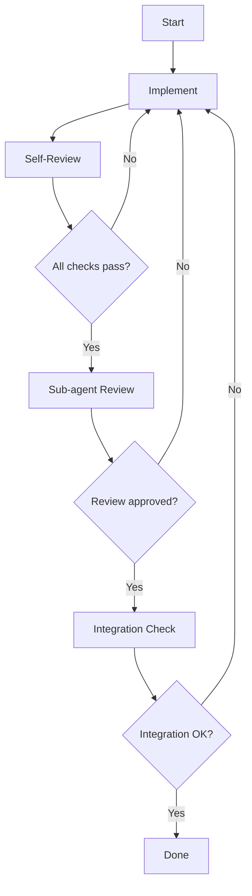

# Verification Before Completion

## Core Principle

**Never mark a task complete until verification is done.** Every deliverable
must pass through defined quality gates before being considered "done."

## Universal Verification Checklist

- [ ] Code compiles without errors (tsc --noEmit)
- [ ] All tests pass (npm test)
- [ ] No lint errors (npm run lint)
- [ ] Formatting is consistent (prettier --check)
- [ ] No hardcoded secrets or debug code
- [ ] Error handling covers all paths (not just happy path)
- [ ] Input validation at all external boundaries
- [ ] Types are explicit (no `any`, no `!`, no `@ts-ignore`)

## By Deliverable Type

### New Feature

- [ ] Implementation matches specification
- [ ] All acceptance criteria met
- [ ] Tests cover: happy path, error paths, edge cases
- [ ] Integration with existing code validated
- [ ] Performance considerations addressed
- [ ] Documentation updated (README, API docs)
- [ ] Changelog updated

### Bug Fix

- [ ] Root cause identified and documented
- [ ] Regression test added (fails without fix)
- [ ] Same pattern checked elsewhere in codebase
- [ ] Fix is minimal and targeted

### Refactoring

- [ ] Existing behavior preserved (all tests pass)
- [ ] No new functionality introduced
- [ ] Dead code removed
- [ ] Complexity reduced (check ast-lens analyze_complexity)
- [ ] Module boundaries respected
- [ ] No API contract changes (unless intentional)

### API Endpoint

- [ ] Request validation (Zod schema)
- [ ] Response format matches spec
- [ ] Authentication/authorization enforced
- [ ] Rate limiting applied
- [ ] Error responses follow standard format
- [ ] OpenAPI spec updated
- [ ] Integration test covering happy + error paths

### Database Change

- [ ] Migration is reversible (has down migration)
- [ ] Indexes added for query patterns
- [ ] No N+1 queries (verify with query logging)
- [ ] Constraints enforced at DB level
- [ ] Migration tested against copy of production data

## Verification Workflow

## Self-Review Questions

Before marking any task complete, ask:

1. "What could go wrong here?"
2. "Have I handled all error paths?"
3. "Is there any edge case I'm missing?"
4. "Will this be maintainable in 6 months?"
5. "What would break if I made a mistake here?"
