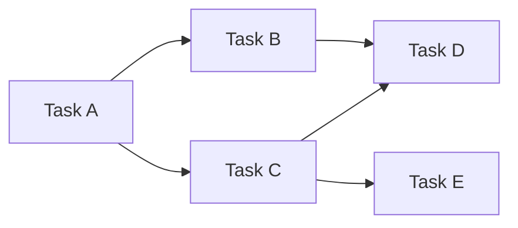

# SDLC Planning

## Requirements Analysis

1. **Clarify scope**: what's in, what's explicitly out
2. **Identify actors**: who interacts with the system
3. **Define acceptance criteria**: concrete, testable conditions
4. **Document constraints**: time, budget, technology, team
5. **Prioritize**: must-have vs nice-to-have (MoSCoW method)

## Task Decomposition

Breaking down work into implementable units:

```
Feature → Epic → Story → Task → Sub-task
  │         │       │       └────── Agent unit of work
  │         │       └───────────── Verifiable deliverable
  │         └───────────────────── Group of related stories
  └─────────────────────────────── Major capability
```

### Rule of Thumb

- Each task should fit in one agent session (1-10 tool calls)
- Each task has a clear "done" condition
- Tasks are independent where possible (parallel execution)
- Dependencies between tasks are explicit

## Effort Estimation

| Size    | Tool Calls | Agent Sessions | Complexity                               |
| ------- | ---------- | -------------- | ---------------------------------------- |
| Trivial | 1-3        | 1              | One file change, no new concepts         |
| Small   | 3-7        | 1              | Single component, known patterns         |
| Medium  | 7-15       | 1-2            | Multiple files, some design decisions    |
| Large   | 15-30      | 2-4            | Multiple components, coordination needed |
| X-Large | 30+        | 4+             | Architecture change, multiple systems    |

## Dependency Mapping



- **Parallel**: A→B, A→C (B and C independent)
- **Sequential**: B→D, C→D (both must complete before D)
- **Blocked**: E blocked on C

## Plan Structure

```markdown
# Implementation Plan

## Goal

(one sentence)

## Prerequisites

- [ ] Setup tasks that must complete first
- [ ] Dependencies to install

## Implementation Steps

### Step 1: [Name]

- Agent: [builder|tester|debugger]
- Skill: [skill to load]
- Input: [what the step starts with]
- Output: [what the step produces]
- Verification: [how to verify success]
- Est. Effort: [small|medium|large]

### Step 2: ...

## Integration

After all steps complete:

- [ ] Integration tests pass
- [ ] No regressions
- [ ] Documentation updated
```

## Risk Assessment

| Risk                  | Likelihood | Impact | Mitigation                          |
| --------------------- | ---------- | ------ | ----------------------------------- |
| Missing requirements  | Medium     | High   | Prototype early, iterative feedback |
| Technical complexity  | Medium     | Medium | Spike/research before commitment    |
| Dependency issues     | Low        | Medium | Pin versions, use lockfiles         |
| Integration conflicts | Medium     | Medium | CI/CD with integration tests        |
| Performance issues    | Low        | High   | Load test before production         |
